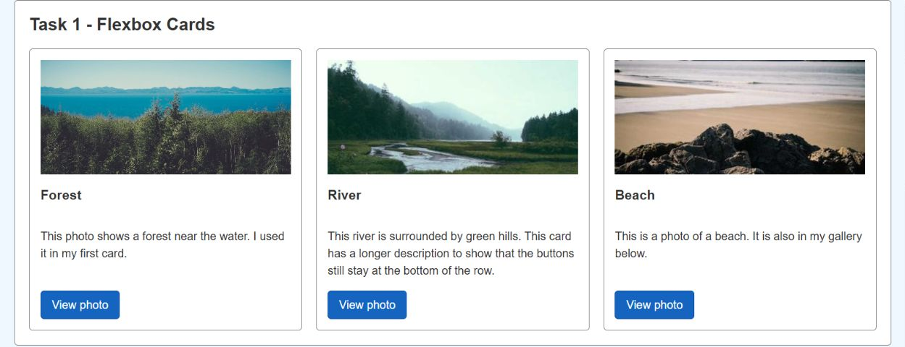
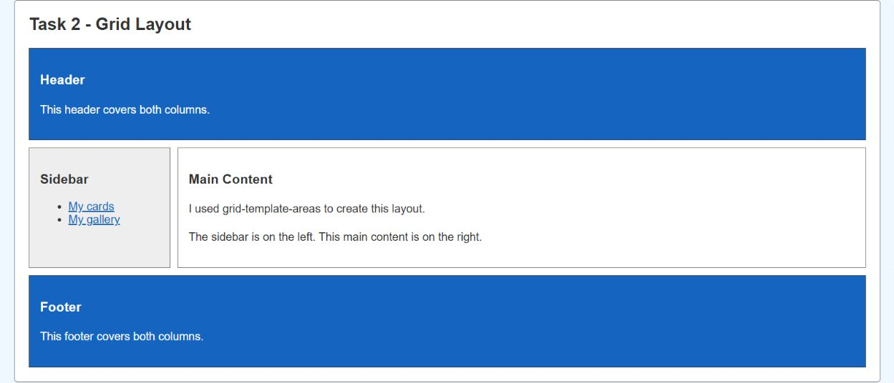
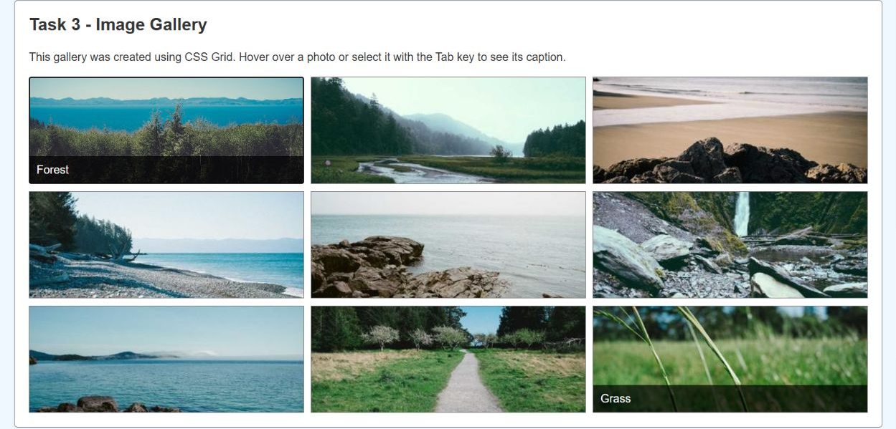
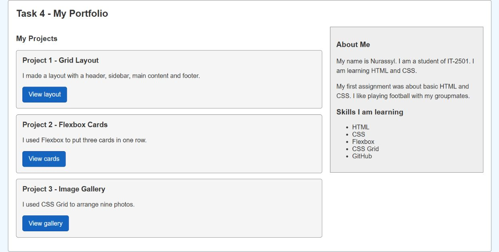

# WEB Technologies 1 - Assignment 2

Name: Nurassyl Zhumagul  
Group: IT-2501  
Course: WEB Technologies 1 (Front End)

I kept the Arial font, light blue background and simple borders from my first assignment. In this assignment, I added Flexbox and Grid layouts.

## Part 1 - Flexbox

### Task 0 - Navigation Bar

I created a navigation bar using Flexbox. The name is on the left and the links are on the right. I used `justify-content`, `align-items` and `gap`.

### Task 1 - Card Row

I made three cards with an image, title, text and button. The cards use Flexbox and have equal heights on desktop. `margin-top: auto` keeps the buttons at the bottom. The background changes on hover. The buttons are links to photos in the gallery.

## Part 2 - CSS Grid

### Task 2 - Grid Layout

I used `grid-template-areas` to make a header, sidebar, main content and footer. The header and footer cover both columns. The sidebar is on the left and the main content is on the right.

### Task 3 - Image Gallery

I added nine nature photos. CSS Grid puts them in three equal columns with a 10px gap. A caption appears when I hover over a photo or focus it with the keyboard.

## Part 3 - Grid and Flexbox

### Task 4 - Portfolio

I used Grid to put my projects on the left and information about me on the right. Each project card uses Flexbox for its title, text and button. The page also has a header and footer.

## Mobile Layout

I used one media query at 768px. The navigation wraps, the cards stack, and the gallery and portfolio use one column. The Grid Areas stack as header, sidebar, main and footer. Gallery captions stay visible on small screens.

## Summary

In this assignment, I practiced Flexbox and CSS Grid. I used Flexbox for the navigation bar and cards. I used Grid for the page layout and image gallery. I also combined Flexbox and Grid in the portfolio section.

## How to Run

Download the project and open `index.html` in a browser, or use VS Code Live Server. Keep `style.css` and the `images` folder next to `index.html`.

I used HTML5 and CSS3. Git and GitHub can be used to save and submit the project. There is no JavaScript or CSS framework.

Photo credits are in [images/SOURCES.md](images/SOURCES.md). My practice notes are in [DEFENSE.md](DEFENSE.md).
