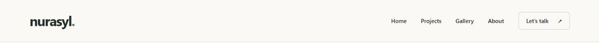
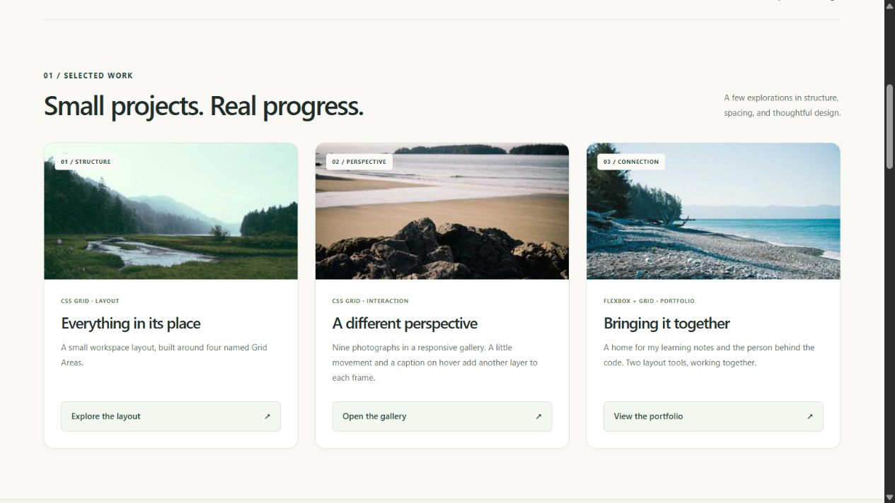
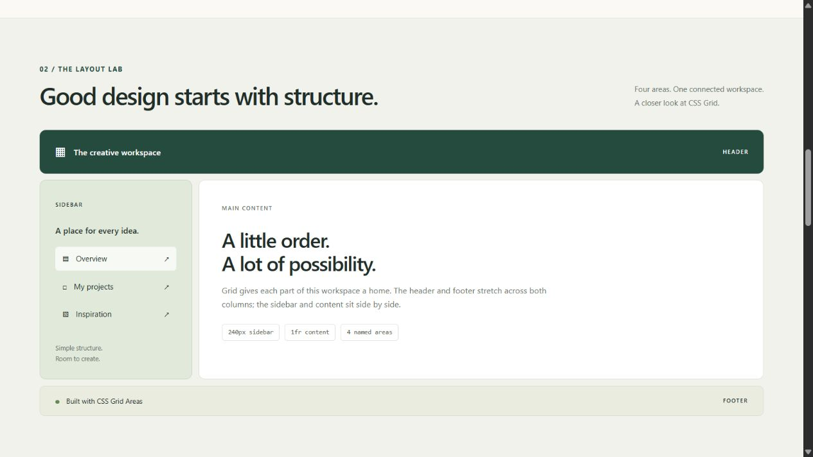
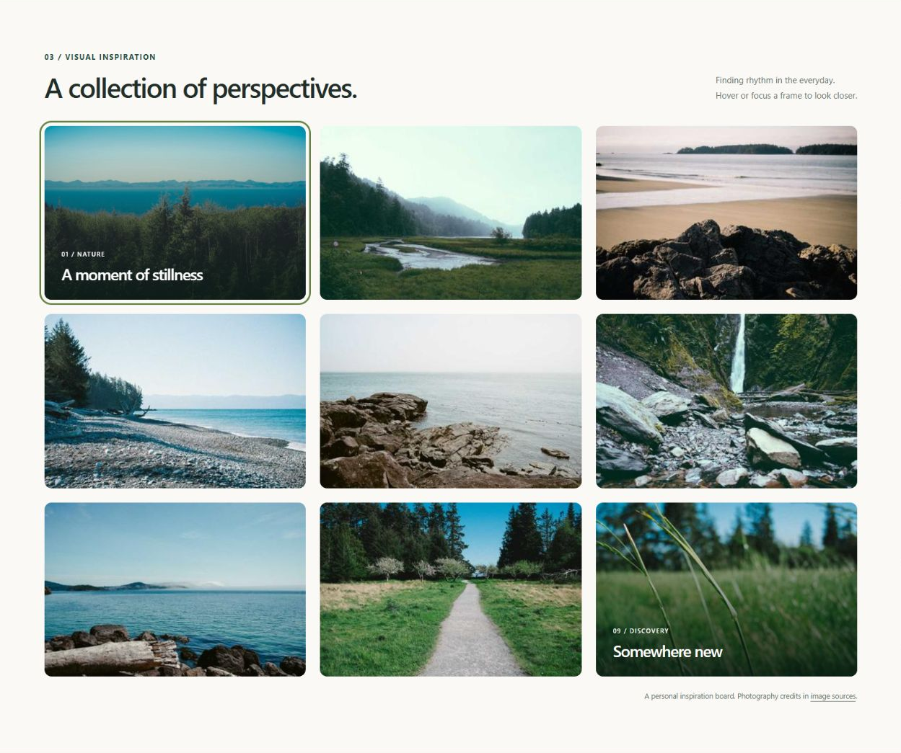
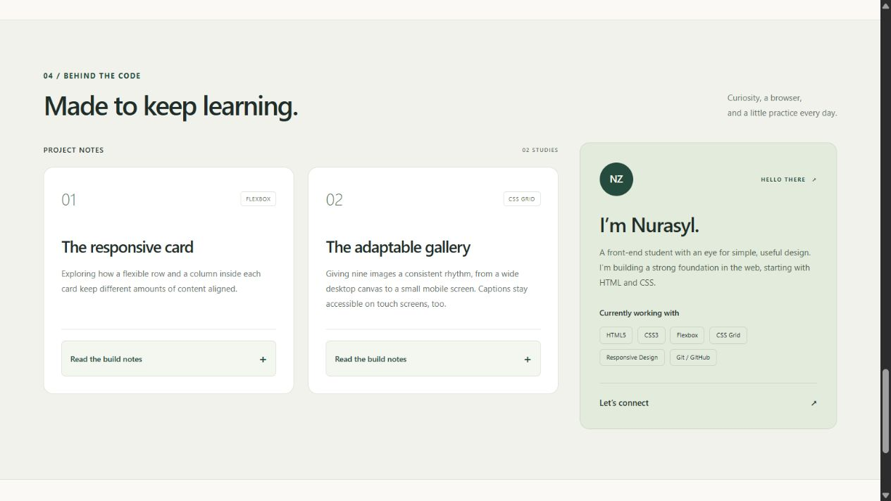

# Assignment #2 — Advanced CSS (Flexbox & Grid)


**Name:** Nurasyl Zhumagul  
**Group:** IT-2501
**Course:** WEB Technologies 1 (Front End)

## Project Overview

Nurasyl — Front-End Developer Portfolio is a responsive personal portfolio made with HTML5 and CSS3. It demonstrates Flexbox for navigation and card content, CSS Grid for page structure and an image gallery, and named Grid Areas for a visible page-layout example. An elegant neutral theme with green accents, rounded cards, consistent spacing, and subtle hover effects keeps the layout clear and readable.

The website uses local images and a system font stack. It does not need JavaScript, a CSS framework, a build step, or an internet connection to display the page.

## Project Structure

```text
assignment-2/
├── index.html
├── style.css
├── README.md
├── DEFENSE.md
├── images/
│   ├── gallery-1.jpg
│   ├── gallery-2.jpg
│   ├── gallery-3.jpg
│   ├── gallery-4.jpg
│   ├── gallery-5.jpg
│   ├── gallery-6.jpg
│   ├── gallery-7.jpg
│   ├── gallery-8.jpg
│   ├── gallery-9.jpg
│   ├── favicon.svg
│   └── SOURCES.md
└── screenshots/
    ├── task0-navbar.png
    ├── task1-cards.png
    ├── task2-grid-layout.png
    ├── task3-gallery.png
    └── task4-portfolio.png
```

Image attribution and source information are recorded in [images/SOURCES.md](images/SOURCES.md). The study guide is in [DEFENSE.md](DEFENSE.md).

## Task 0 — Navigation Bar

The semantic page header contains a logo and a navigation menu. The `.navbar` container uses `display: flex` to put the logo and the navigation next to each other. `justify-content: space-between` places the logo on the left and the links on the right, while `align-items: center` aligns them vertically. `gap` creates consistent spacing without adding a separate margin to every link.

The `.nav-links` list is also a Flexbox container. Its Home, Projects, Gallery, About, and Let’s talk links lead to real section IDs on this page; Let’s talk opens the contact section. The links have a hover effect and a visible keyboard focus state.



*Figure 1. Desktop navigation with the logo on the left and evenly spaced links on the right.*

## Task 1 — Card Row

The `.cards-container` uses Flexbox to show three cards in a horizontal desktop row. Each card contains an image, a title, a description, and a button-style link with a real destination on the page. The container uses a consistent `gap`, and `flex: 1` gives each card an equal share of the available row width.

The row stretches its cards to the same height. Each `.card` and its `.card-body` use `display: flex` and `flex-direction: column` to arrange the content vertically. The body also uses `flex: 1` to fill the space below the image. The `.card-action` uses `margin-top: auto`, which absorbs spare vertical space in that body and keeps the action at the bottom even when descriptions differ in length. A transition makes the raised-card hover effect smooth.



*Figure 2. Three equal-height Flexbox cards with aligned actions and consistent gaps.*

## Task 2 — Page Layout with Grid Areas

The `.grid-layout` section demonstrates a complete page structure using CSS Grid. `grid-template-columns: 240px 1fr` gives the sidebar a fixed width and lets the main area use the remaining space. `grid-template-rows: auto 1fr auto` defines the header, content, and footer rows.

The named layout is easy to read:

```css
grid-template-areas:
    "header header"
    "sidebar main"
    "footer footer";
```

Each child is assigned to a matching area using `grid-area`: `.grid-header` uses `header`, `.grid-sidebar` uses `sidebar`, `.grid-main` uses `main`, and `.grid-footer` uses `footer`. The header spans the top, the sidebar sits on the left of the main content, and the footer spans the bottom. Labels, borders, padding, and backgrounds make every area distinguishable.



*Figure 3. Named Grid Areas showing a full-width header and footer around a sidebar and main content.*

## Task 3 — Image Gallery

The gallery contains nine local JPG images. The `.gallery` container uses `display: grid`, `grid-template-columns: repeat(3, 1fr)`, and `gap` to create three equal-width desktop columns with consistent spacing.

Each `.gallery-item` uses `position: relative` and `overflow: hidden`. Its caption is positioned over the image with `position: absolute`. On devices with hover, the caption starts at `opacity: 0` and fades to `opacity: 1` when the gallery item is hovered. A small image scale effect adds feedback. Consistent image dimensions and `object-fit: cover` keep the gallery tidy without stretching the photos.

The captions also appear when the items receive keyboard focus. On devices without hover, captions remain visible so touch users can read them.



*Figure 4. A nine-image, three-column CSS Grid gallery with caption overlays.*

## Task 4 — Portfolio Page

The page combines a semantic header, main content, an information sidebar, and a footer. The header navigation uses Flexbox. The main `.portfolio-layout` uses CSS Grid with `grid-template-columns: 2fr 1fr`: the projects area occupies the wider left column, and the `.info-sidebar` appears on the right.

Inside the projects area, each `.project-card` uses Flexbox with `flex-direction: column` to arrange its title, description, and action. `.project-action` uses `margin-top: auto` to place the action after any remaining space. The project actions open native HTML `<details>` notes, so they work without JavaScript or placeholder project URLs.

The information sidebar introduces the student, lists skills and technologies, and links to the separate contact section below it. The contact copy refers to the university course; no unverified email address or social account is included. The page footer spans the bottom of the website. Shared spacing, colors, borders, and typography connect all sections visually.



*Figure 5. A two-column portfolio layout with project cards on the left and student information on the right.*

## Responsive Design

Media queries adapt the layout to narrower screens:

- At `1000px` and below, the gallery changes from three columns to two, and the project notes inside `.project-list` stack vertically.
- At `768px` and below, navigation wraps cleanly, the Flexbox card row becomes a column, and the Grid Areas example becomes one column in the order header → sidebar → main → footer. The portfolio also becomes one column, with the sidebar following the projects.
- At `520px` and below, the gallery becomes one column.

Flexible widths, `box-sizing: border-box`, constrained images, and wrapping text help content stay inside the viewport. Keyboard focus styles, image alternative text, touch-friendly captions, and reduced-motion support also make the page easier to use.


Git and GitHub are development/submission tools; the website itself only requires a web browser. Preparing these files does not automatically create commits or publish a GitHub repository.

